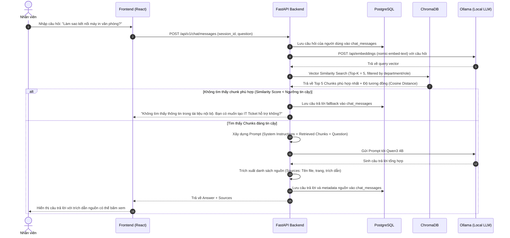

# ARCHITECTURE.md

# Kiến trúc Hệ thống Enterprise Local AI Assistant

Tài liệu này đặc tả chi tiết kiến trúc tổng thể, mô hình phân tầng, luồng dữ liệu, phân quyền RBAC và nguyên lý hoạt động của hệ thống trợ lý AI nội bộ doanh nghiệp.

---

## 1. Mục tiêu và Nguyên lý thiết kế (Design Principles)

1. **Local-First & Data Sovereignty**: 100% dữ liệu văn bản, vector embedding và mô hình ngôn ngữ lớn (LLM) được lưu trữ và thực thi tại máy chủ cục bộ / laptop. Tuyệt đối không để lộ dữ liệu nội bộ ra ngoài Internet.
2. **Modular Monolith**: Thay vì phân tán microservices gây tốn tài nguyên và khó khăn khi vận hành trên một laptop, hệ thống được cấu trúc dạng Monolithic phân chia module nghiêm ngặt:
   - Các module độc lập về ranh giới nghiệp vụ (Auth, Documents, RAG, Tickets, Dashboard).
   - Dễ triển khai, dễ kiểm thử (Unit test/Integration test) và tiết kiệm RAM tối đa.
3. **Separation of Concerns (SoC)**:
   - **Frontend**: Chỉ chịu trách nhiệm về Presentation, State Management và tương tác người dùng.
   - **Backend API (FastAPI)**: Đảm nhận Validation, Authentication, Authorization và điều phối nghiệp vụ.
   - **RAG Engine**: Module chuyên biệt xử lý văn bản, vector hóa và tổng hợp tri thức.
   - **PostgreSQL**: Lưu trữ dữ liệu có cấu trúc (ACID compliance).
   - **ChromaDB**: Lưu trữ và tìm kiếm vector tương đồng (ANN Search).
   - **Ollama**: Quản lý và thực thi mô hình LLM cục bộ (Inference engine).

---

## 2. Sơ đồ Kiến trúc Tổng thể (High-Level Architecture)

```mermaid
graph TD
    subgraph Client Layer
        Browser["Trình duyệt Người dùng (React + TypeScript + Tailwind)"]
    end

    subgraph API & Application Gateway Layer (FastAPI)
        AuthMiddleware["JWT Authentication & RBAC Middleware"]
        RouterAuth["/api/v1/auth"]
        RouterDocs["/api/v1/documents"]
        RouterRAG["/api/v1/chat"]
        RouterTickets["/api/v1/tickets"]
        RouterDashboard["/api/v1/dashboard"]
    end

    subgraph Core Services Layer
        AuthService["Authentication & User Service"]
        DocService["Document Management Service"]
        RAGService["RAG Pipeline Coordinator"]
        TicketService["IT Ticket Service"]
        StatsService["Dashboard Analytics Service"]
    end

    subgraph RAG & AI Engine
        Parser["Document Parser (PDF, DOCX, TXT, XLSX, CSV)"]
        PIIEngine["PII Masker & Redaction Engine (Nghị định 13)"]
        Chunker["Text Chunker (Recursive Character Splitter)"]
        Embedder["Embedding Client (nomic-embed-text)"]
        VectorStore["ChromaDB Local Vector Collection"]
        BM25["BM25 Sparse Lexical Search + RRF Fusion"]
        Reranker["Local Cross-Encoder Reranker (FlashRank ONNX)"]
        LLMClient["Ollama Client (Qwen 2.5 3B)"]
    end

    subgraph Persistence Layer
        Postgres[(PostgreSQL Relational DB)]
        LocalFS[(Local Storage / Uploads)]
    end

    Browser -->|HTTP/JSON & SSE| AuthMiddleware
    AuthMiddleware --> RouterAuth & RouterDocs & RouterRAG & RouterTickets & RouterDashboard

    RouterAuth --> AuthService
    RouterDocs --> DocService
    RouterRAG --> RAGService
    RouterTickets --> TicketService
    RouterDashboard --> StatsService

    AuthService --> Postgres
    TicketService --> Postgres
    StatsService --> Postgres

    DocService --> LocalFS
    DocService --> Postgres
    DocService --> Parser
    Parser --> PIIEngine --> Chunker --> Embedder --> VectorStore

    RAGService --> Embedder
    RAGService --> VectorStore
    RAGService --> BM25
    RAGService --> Reranker
    RAGService --> LLMClient
    RAGService --> Postgres
```

---

## 3. Luồng xử lý chi tiết (Data Flows)

### 3.1. Luồng Nạp và Xử lý Tài liệu (Document Ingestion Pipeline)

Khi Admin tải lên tài liệu mới:

```text
[Admin Upload File] (PDF / DOCX / TXT)
        │
        ▼
[FastAPI: Security & Mime-Type Validation]
        │
        ▼
[Lưu tệp vào Local Filesystem] + [Ghi nhận Document record trong PostgreSQL (Status: UPLOADED)]
        │
        ▼
[Document Parser]: Đọc text thô, lọc bỏ ký tự đặc biệt, metadata rác (Status: PROCESSING)
        │
        ▼
[Text Chunker]: Chia nhỏ thành các đoạn có kích thước tối ưu (Chunk Size: 500-800 tokens, Overlap: 100 tokens)
        │
        ▼
[Embedding Generator]: Gửi từng Chunk đến Ollama (Model: nomic-embed-text) để nhận vector 768 chiều
        │
        ▼
[ChromaDB Indexing]: Lưu vector, nội dung chunk và metadata (document_id, file_name, page_number)
        │
        ▼
[Cập nhật trạng thái Document trong PostgreSQL (Status: INDEXED)]
```

### 3.2. Luồng Hỏi đáp Tri thức (RAG Query Execution Flow)

Khi Nhân viên đặt câu hỏi:



---

## 4. Mô hình Phân quyền người dùng (Role-Based Access Control - RBAC)

Hệ thống định nghĩa 3 vai trò chính với ranh giới trách nhiệm rõ ràng:

| Quyền hạn / Chức năng | EMPLOYEE | IT_ADMIN | SUPER_ADMIN |
| :--- | :---: | :---: | :---: |
| Đặt câu hỏi AI RAG Chat | ✅ | ✅ | ✅ |
| Xem lịch sử chat cá nhân | ✅ | ✅ | ✅ |
| Tạo IT Support Ticket | ✅ | ✅ | ✅ |
| Theo dõi ticket cá nhân tạo | ✅ | ✅ | ✅ |
| Tiếp nhận và xử lý toàn bộ IT Ticket | ❌ | ✅ | ✅ |
| Cập nhật trạng thái Ticket (Open/Resolved) | ❌ | ✅ | ✅ |
| Upload / Quản lý tài liệu IT Knowledge | ❌ | ✅ | ✅ |
| Quản lý tài liệu mọi phòng ban | ❌ | ❌ | ✅ |
| Quản lý tài khoản người dùng & phòng ban | ❌ | ❌ | ✅ |
| Phân quyền & Gán vai trò (Roles) | ❌ | ❌ | ✅ |
| Xem Dashboard thống kê toàn hệ thống | ❌ | Tùy chỉnh (IT Stats) | ✅ (Toàn diện) |
| Xem Audit Logs hệ thống | ❌ | ❌ | ✅ |

---

## 5. Chiến lược tối ưu hóa cho Laptop (Hardware Optimization)

Để đảm bảo hệ thống vận hành mượt mà trên laptop thông thường mà không cần GPU rời đắt đỏ:

1. **Lựa chọn mô hình Local LLM**:
   - Mặc định: `Qwen3 4B` hoặc `Qwen2.5 3B` (chạy qua Ollama với 4-bit quantization - GGUF). Tốn khoảng 2.0GB - 2.8GB RAM, tốc độ sinh 20-30 tokens/giây trên CPU hiện đại.
   - Fallback cho máy yếu (8GB RAM): `Qwen2.5 1.5B` (tốn ~1.2GB RAM).
2. **Lựa chọn mô hình Embedding**:
   - `nomic-embed-text`: Dung lượng nhẹ (~280MB), hỗ trợ độ dài ngữ cảnh lớn (8192 tokens), tốc độ tạo vector dưới 50ms/chunk.
3. **Quản lý RAM & Connection**:
   - ChromaDB chạy dạng Embedded Persistent Store hoặc lightweight Docker container, không giữ toàn bộ vector vào RAM liên tục.
   - SQLAlchemy cấu hình Connection Pool hợp lý (Pool size: 5, Max overflow: 10).
   - FastAPI chạy `uvicorn` với 1-2 workers trên môi trường laptop.

---

## 6. Tiêu chuẩn An toàn thông tin (Security Standards)

* **Password Security**: Sử dụng thư viện `passlib` với thuật toán băm `bcrypt` (work factor: 12). Tuyệt đối không lưu plaintext password.
* **Token-based Authentication**: JWT (JSON Web Token) với chuẩn mã hóa `HS256`, thiết lập thời gian hết hạn hợp lý (Access Token: 60 phút, Refresh Token: 7 ngày).
* **Input Validation**: Mọi dữ liệu vào ra API đều được kiểm tra chặt chẽ bởi Pydantic Schema.
* **File Upload Safety**:
  - Giới hạn dung lượng tối đa (Ví dụ: 25MB / file).
  - Kiểm tra đuôi file và MIME-type thực tế (chỉ cho phép `.pdf`, `.docx`, `.txt`).
  - Đổi tên tệp ngẫu nhiên (UUID) khi lưu vào đĩa cứng để chống tấn công Path Traversal.
