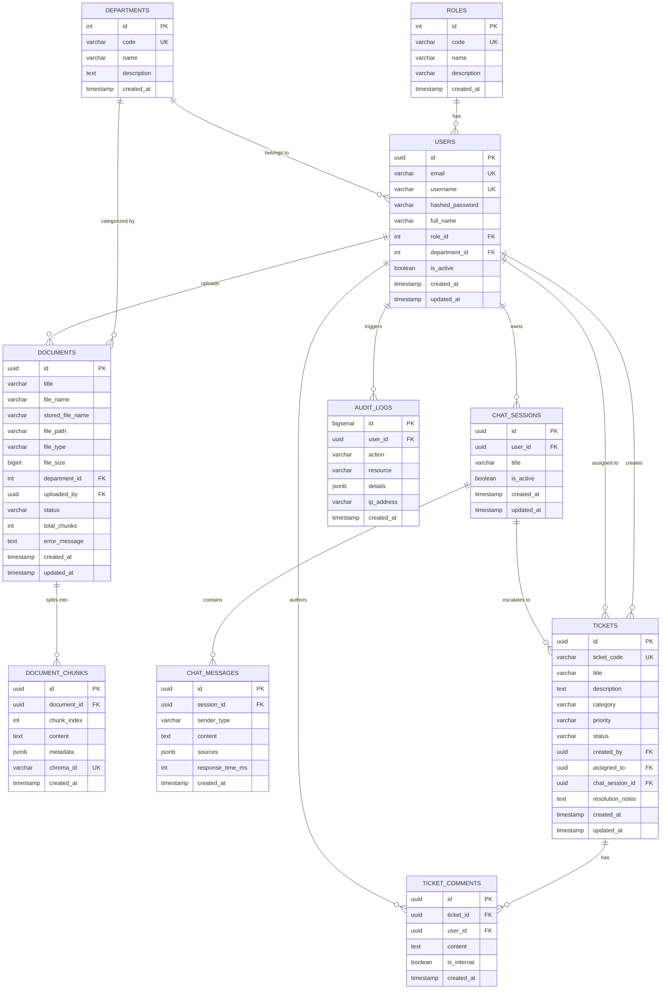

# DATABASE.md

# Thiết kế Cơ sở Dữ liệu Enterprise Local AI Assistant

Tài liệu này đặc tả chi tiết thiết kế Cơ sở dữ liệu quan hệ (PostgreSQL) phục vụ hệ thống, bao gồm danh mục bảng, cấu trúc cột, khóa chính (PK), khóa ngoại (FK), chỉ mục (Indexes), ràng buộc toàn vẹn (Constraints) và sơ đồ quan hệ thực thể (ERD).

---

## 1. Sơ đồ Quan hệ Thực thể (Entity-Relationship Diagram - ERD)

---

## 2. Chi tiết các Bảng và Thuộc tính (Data Dictionary)

### 2.1. Bảng `roles` (Vai trò người dùng)
* Lưu trữ danh mục các vai trò trong hệ thống phục vụ RBAC.
* Dữ liệu khởi tạo (Seed Data):
  - `SUPER_ADMIN`: Quản trị toàn hệ thống.
  - `IT_ADMIN`: Quản trị hạ tầng, IT tickets, IT knowledge base.
  - `EMPLOYEE`: Nhân viên thông thường.

| Cột | Kiểu dữ liệu | Ràng buộc | Diễn giải |
| :--- | :--- | :--- | :--- |
| `id` | `SERIAL` | `PRIMARY KEY` | Khóa chính tự tăng |
| `code` | `VARCHAR(50)` | `NOT NULL, UNIQUE` | Mã vai trò (`SUPER_ADMIN`, `IT_ADMIN`, `EMPLOYEE`) |
| `name` | `VARCHAR(100)` | `NOT NULL` | Tên hiển thị vai trò |
| `description` | `VARCHAR(255)` | `NULL` | Mô tả phạm vi quyền hạn |
| `created_at` | `TIMESTAMP WITH TIME ZONE` | `DEFAULT CURRENT_TIMESTAMP` | Thời điểm tạo |

---

### 2.2. Bảng `departments` (Phòng ban doanh nghiệp)
* Phân loại nhân viên và tài liệu theo cấu trúc tổ chức.

| Cột | Kiểu dữ liệu | Ràng buộc | Diễn giải |
| :--- | :--- | :--- | :--- |
| `id` | `SERIAL` | `PRIMARY KEY` | Khóa chính tự tăng |
| `code` | `VARCHAR(50)` | `NOT NULL, UNIQUE` | Mã phòng ban (`IT`, `HR`, `FINANCE`, `SALES`) |
| `name` | `VARCHAR(100)` | `NOT NULL` | Tên phòng ban |
| `description` | `TEXT` | `NULL` | Mô tả chức năng nhiệm vụ |
| `created_at` | `TIMESTAMP WITH TIME ZONE` | `DEFAULT CURRENT_TIMESTAMP` | Thời điểm tạo |

---

### 2.3. Bảng `users` (Tài khoản người dùng)
* Quản lý thông tin xác thực và hồ sơ nhân viên.

| Cột | Kiểu dữ liệu | Ràng buộc | Diễn giải |
| :--- | :--- | :--- | :--- |
| `id` | `UUID` | `PRIMARY KEY, DEFAULT gen_random_uuid()` | Khóa chính dạng UUID |
| `email` | `VARCHAR(255)` | `NOT NULL, UNIQUE` | Địa chỉ email đăng nhập |
| `username` | `VARCHAR(100)` | `NOT NULL, UNIQUE` | Tên người dùng |
| `hashed_password`| `VARCHAR(255)` | `NOT NULL` | Mật khẩu băm (Bcrypt hash) |
| `full_name` | `VARCHAR(150)` | `NOT NULL` | Họ và tên hiển thị |
| `role_id` | `INT` | `NOT NULL, FK -> roles(id)` | Vai trò người dùng |
| `department_id` | `INT` | `NULL, FK -> departments(id)` | Phòng ban trực thuộc |
| `is_active` | `BOOLEAN` | `DEFAULT TRUE` | Trạng thái kích hoạt tài khoản |
| `created_at` | `TIMESTAMP WITH TIME ZONE` | `DEFAULT CURRENT_TIMESTAMP` | Thời điểm đăng ký |
| `updated_at` | `TIMESTAMP WITH TIME ZONE` | `DEFAULT CURRENT_TIMESTAMP` | Thời điểm cập nhật cuối |

* **Chỉ mục (Indexes)**:
  - `idx_users_email`: `ON users(email)`
  - `idx_users_username`: `ON users(username)`
  - `idx_users_role_id`: `ON users(role_id)`
  - `idx_users_department_id`: `ON users(department_id)`

---

### 2.4. Bảng `documents` (Tài liệu doanh nghiệp)
* Quản lý tệp tin tài liệu được nạp vào hệ thống để phục vụ RAG.

| Cột | Kiểu dữ liệu | Ràng buộc | Diễn giải |
| :--- | :--- | :--- | :--- |
| `id` | `UUID` | `PRIMARY KEY, DEFAULT gen_random_uuid()` | Khóa chính tài liệu |
| `title` | `VARCHAR(255)` | `NOT NULL` | Tiêu đề tài liệu |
| `file_name` | `VARCHAR(255)` | `NOT NULL` | Tên gốc của tệp tin khi upload |
| `stored_file_name`| `VARCHAR(255)` | `NOT NULL, UNIQUE` | Tên tệp tin đã mã hóa UUID trên đĩa |
| `file_path` | `VARCHAR(500)` | `NOT NULL` | Đường dẫn lưu trữ nội bộ |
| `file_type` | `VARCHAR(20)` | `NOT NULL` | Đuôi tệp (`PDF`, `DOCX`, `TXT`) |
| `file_size` | `BIGINT` | `NOT NULL` | Dung lượng tệp (bytes) |
| `department_id` | `INT` | `NULL, FK -> departments(id)` | Phòng ban sở hữu tài liệu |
| `uploaded_by` | `UUID` | `NOT NULL, FK -> users(id)` | Người tải lên |
| `status` | `VARCHAR(30)` | `NOT NULL, DEFAULT 'UPLOADED'` | Trạng thái (`UPLOADED`, `PROCESSING`, `INDEXED`, `FAILED`) |
| `total_chunks` | `INT` | `DEFAULT 0` | Số lượng đoạn (chunks) sinh ra |
| `error_message` | `TEXT` | `NULL` | Ghi chú lỗi nếu Indexing thất bại |
| `created_at` | `TIMESTAMP WITH TIME ZONE` | `DEFAULT CURRENT_TIMESTAMP` | Thời điểm upload |
| `updated_at` | `TIMESTAMP WITH TIME ZONE` | `DEFAULT CURRENT_TIMESTAMP` | Thời điểm cập nhật |

* **Chỉ mục (Indexes)**:
  - `idx_documents_status`: `ON documents(status)`
  - `idx_documents_department`: `ON documents(department_id)`
  - `idx_documents_uploaded_by`: `ON documents(uploaded_by)`

---

### 2.5. Bảng `document_chunks` (Các phân đoạn văn bản)
* Lưu trữ các đoạn text thô đã cắt từ tài liệu để đối chiếu và trích dẫn nguồn.

| Cột | Kiểu dữ liệu | Ràng buộc | Diễn giải |
| :--- | :--- | :--- | :--- |
| `id` | `UUID` | `PRIMARY KEY, DEFAULT gen_random_uuid()` | Khóa chính của chunk |
| `document_id` | `UUID` | `NOT NULL, FK -> documents(id) ON DELETE CASCADE` | Thuộc tài liệu nào |
| `chunk_index` | `INT` | `NOT NULL` | Thứ tự của chunk trong tài liệu (0, 1, 2...) |
| `content` | `TEXT` | `NOT NULL` | Nội dung văn bản của đoạn trích |
| `metadata` | `JSONB` | `DEFAULT '{}'::jsonb` | Metadata bổ sung (trang, số dòng, tiêu đề mục) |
| `chroma_id` | `VARCHAR(100)` | `NOT NULL, UNIQUE` | ID liên kết bản ghi vector trong ChromaDB |
| `created_at` | `TIMESTAMP WITH TIME ZONE` | `DEFAULT CURRENT_TIMESTAMP` | Thời điểm tạo |

* **Chỉ mục (Indexes)**:
  - `idx_chunks_document_id`: `ON document_chunks(document_id)`
  - `idx_chunks_chroma_id`: `ON document_chunks(chroma_id)`

---

### 2.6. Bảng `chat_sessions` (Phiên hội thoại AI)
* Quản lý từng luồng hội thoại độc lập của người dùng với trợ lý AI.

| Cột | Kiểu dữ liệu | Ràng buộc | Diễn giải |
| :--- | :--- | :--- | :--- |
| `id` | `UUID` | `PRIMARY KEY, DEFAULT gen_random_uuid()` | Khóa chính phiên chat |
| `user_id` | `UUID` | `NOT NULL, FK -> users(id) ON DELETE CASCADE` | Người sở hữu phiên chat |
| `title` | `VARCHAR(255)` | `NOT NULL, DEFAULT 'Cuộc hội thoại mới'` | Tiêu đề phiên chat |
| `is_active` | `BOOLEAN` | `DEFAULT TRUE` | Trạng thái hoạt động |
| `created_at` | `TIMESTAMP WITH TIME ZONE` | `DEFAULT CURRENT_TIMESTAMP` | Thời điểm tạo |
| `updated_at` | `TIMESTAMP WITH TIME ZONE` | `DEFAULT CURRENT_TIMESTAMP` | Thời điểm có tin nhắn mới |

* **Chỉ mục (Indexes)**:
  - `idx_chat_sessions_user_id`: `ON chat_sessions(user_id)`

---

### 2.7. Bảng `chat_messages` (Tin nhắn hỏi đáp)
* Lưu trữ chi tiết từng câu hỏi của người dùng và câu trả lời sinh bởi RAG.

| Cột | Kiểu dữ liệu | Ràng buộc | Diễn giải |
| :--- | :--- | :--- | :--- |
| `id` | `UUID` | `PRIMARY KEY, DEFAULT gen_random_uuid()` | Khóa chính tin nhắn |
| `session_id` | `UUID` | `NOT NULL, FK -> chat_sessions(id) ON DELETE CASCADE` | Thuộc phiên hội thoại nào |
| `sender_type` | `VARCHAR(20)` | `NOT NULL` | Người gửi (`USER`, `ASSISTANT`, `SYSTEM`) |
| `content` | `TEXT` | `NOT NULL` | Nội dung tin nhắn / câu trả lời |
| `sources` | `JSONB` | `DEFAULT '[]'::jsonb` | Danh sách nguồn trích dẫn (`document_name`, `page`, `quote`) |
| `response_time_ms`| `INT` | `NULL` | Thời gian phản hồi tính bằng mili-giây (cho benchmark) |
| `created_at` | `TIMESTAMP WITH TIME ZONE` | `DEFAULT CURRENT_TIMESTAMP` | Thời điểm gửi |

* **Chỉ mục (Indexes)**:
  - `idx_chat_messages_session_id`: `ON chat_messages(session_id)`
  - `idx_chat_messages_created_at`: `ON chat_messages(created_at)`

---

### 2.8. Bảng `tickets` (Yêu cầu hỗ trợ IT)
* Quản lý phiếu yêu cầu hỗ trợ khi AI không thể giải quyết hoặc người dùng chủ động tạo.

| Cột | Kiểu dữ liệu | Ràng buộc | Diễn giải |
| :--- | :--- | :--- | :--- |
| `id` | `UUID` | `PRIMARY KEY, DEFAULT gen_random_uuid()` | Khóa chính ticket |
| `ticket_code` | `VARCHAR(30)` | `NOT NULL, UNIQUE` | Mã hiển thị thân thiện (VD: `IT-2026-0001`) |
| `title` | `VARCHAR(255)` | `NOT NULL` | Tiêu đề sự cố / yêu cầu |
| `description` | `TEXT` | `NOT NULL` | Mô tả chi tiết vấn đề gặp phải |
| `category` | `VARCHAR(50)` | `NOT NULL, DEFAULT 'GENERAL'` | Phân loại (`NETWORK`, `HARDWARE`, `SOFTWARE`, `ACCOUNT`, `GENERAL`) |
| `priority` | `VARCHAR(20)` | `NOT NULL, DEFAULT 'MEDIUM'` | Mức độ ưu tiên (`LOW`, `MEDIUM`, `HIGH`, `URGENT`) |
| `status` | `VARCHAR(20)` | `NOT NULL, DEFAULT 'OPEN'` | Trạng thái (`OPEN`, `IN_PROGRESS`, `WAITING`, `RESOLVED`, `CLOSED`) |
| `created_by` | `UUID` | `NOT NULL, FK -> users(id)` | Nhân viên tạo ticket |
| `assigned_to` | `UUID` | `NULL, FK -> users(id)` | IT Admin được phân công xử lý |
| `chat_session_id`| `UUID` | `NULL, FK -> chat_sessions(id)` | Phiên chat AI liên quan dẫn tới việc tạo ticket |
| `resolution_notes`| `TEXT` | `NULL` | Ghi chú hướng dẫn xử lý khi hoàn tất |
| `created_at` | `TIMESTAMP WITH TIME ZONE` | `DEFAULT CURRENT_TIMESTAMP` | Thời điểm tạo |
| `updated_at` | `TIMESTAMP WITH TIME ZONE` | `DEFAULT CURRENT_TIMESTAMP` | Thời điểm cập nhật cuối |

* **Chỉ mục (Indexes)**:
  - `idx_tickets_ticket_code`: `ON tickets(ticket_code)`
  - `idx_tickets_status`: `ON tickets(status)`
  - `idx_tickets_created_by`: `ON tickets(created_by)`
  - `idx_tickets_assigned_to`: `ON tickets(assigned_to)`

---

### 2.9. Bảng `ticket_comments` (Trao đổi trong Ticket)
* Cho phép nhân viên và IT Admin trao đổi thêm về giải pháp kỹ thuật.

| Cột | Kiểu dữ liệu | Ràng buộc | Diễn giải |
| :--- | :--- | :--- | :--- |
| `id` | `UUID` | `PRIMARY KEY, DEFAULT gen_random_uuid()` | Khóa chính bình luận |
| `ticket_id` | `UUID` | `NOT NULL, FK -> tickets(id) ON DELETE CASCADE` | Thuộc ticket nào |
| `user_id` | `UUID` | `NOT NULL, FK -> users(id)` | Tác giả bình luận |
| `content` | `TEXT` | `NOT NULL` | Nội dung phản hồi |
| `is_internal` | `BOOLEAN` | `DEFAULT FALSE` | Ghi chú nội bộ IT (chỉ IT Admin thấy) |
| `created_at` | `TIMESTAMP WITH TIME ZONE` | `DEFAULT CURRENT_TIMESTAMP` | Thời điểm bình luận |

* **Chỉ mục (Indexes)**:
  - `idx_ticket_comments_ticket_id`: `ON ticket_comments(ticket_id)`

---

### 2.10. Bảng `audit_logs` (Nhật ký kiểm toán an toàn)
* Ghi nhận các thao tác quan trọng: Đăng nhập thất bại, upload tài liệu, xóa tài liệu, thay đổi quyền người dùng.

| Cột | Kiểu dữ liệu | Ràng buộc | Diễn giải |
| :--- | :--- | :--- | :--- |
| `id` | `BIGSERIAL` | `PRIMARY KEY` | Khóa chính tự tăng |
| `user_id` | `UUID` | `NULL, FK -> users(id) ON DELETE SET NULL` | Người thực hiện |
| `action` | `VARCHAR(100)` | `NOT NULL` | Hành động (`USER_LOGIN`, `DOC_UPLOAD`, `DOC_DELETE`, `ROLE_CHANGE`) |
| `resource` | `VARCHAR(100)` | `NOT NULL` | Đối tượng bị tác động (`AUTH`, `DOCUMENTS`, `USERS`, `TICKETS`) |
| `details` | `JSONB` | `DEFAULT '{}'::jsonb` | Dữ liệu chi tiết trước và sau thay đổi |
| `ip_address` | `VARCHAR(45)` | `NULL` | Địa chỉ IP của client |
| `created_at` | `TIMESTAMP WITH TIME ZONE` | `DEFAULT CURRENT_TIMESTAMP` | Thời điểm xảy ra sự kiện |

* **Chỉ mục (Indexes)**:
  - `idx_audit_logs_user_id`: `ON audit_logs(user_id)`
  - `idx_audit_logs_action`: `ON audit_logs(action)`
  - `idx_audit_logs_created_at`: `ON audit_logs(created_at)`
