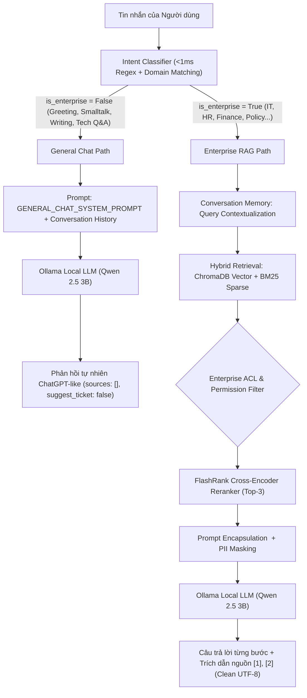

# RAG.md

# Thiết kế Chi tiết Pipeline RAG (Retrieval-Augmented Generation)

Tài liệu này đặc tả quy trình kỹ thuật, thuật toán và chiến lược triển khai hệ sinh thái RAG cục bộ (Local RAG) cho hệ thống Enterprise Local AI Assistant, bảo đảm tính chính xác, khả năng trích dẫn nguồn thực tế và loại trừ triệt để hiện tượng ảo giác (hallucination).

---

## 1. Triết lý Thiết kế Kiến trúc Kép (Dual-Path Architecture)

Trong hệ thống Enterprise Local AI Assistant, kiến trúc xử lý tin nhắn được chia thành 2 luồng độc lập qua **Intent Classifier (<1ms)**:

1. **Nhánh General Chat & Hỗ trợ Công việc (Zero RAG)**:
   - Áp dụng cho: Chào hỏi ("hi", "xin chào"), hỏi thăm/tâm sự ("mệt mỏi quá"), kiến thức CNTT phổ thông (VLAN là gì, Docker vs VM), soạn thảo email, dịch thuật, tóm tắt.
   - Cơ chế: Gọi trực tiếp mô hình ngôn ngữ lớn (Qwen 2.5 3B) với `GENERAL_CHAT_SYSTEM_PROMPT`.
   - Lợi ích: Tốc độ phản hồi tức thì, giọng văn tự nhiên như ChatGPT, **hoàn toàn không kích hoạt vector search**, không trích xuất văn bản rác và không ép người dùng vào quy trình hay tạo ticket.

2. **Nhánh Enterprise Knowledge Base RAG (Grounded Retrieval)**:
   - Áp dụng cho: Tra cứu chính sách, quy chế, quy trình kỹ thuật, sự cố hạ tầng nội bộ, văn bản pháp lý, kế toán, nhân sự.
   - Cơ chế: Multi-turn Context Reformulation -> Hybrid Search (ChromaDB Cosine + BM25 Lexical + Reciprocal Rank Fusion) -> FlashRank Cross-Encoder Reranker -> Encapsulation `<company_context>` -> Generation với `ENTERPRISE_RAG_SYSTEM_PROMPT`.
   - Nguyên tắc **No Context, No Hallucination**: AI không bịa đặt số hiệu hay quy trình. Mọi câu trả lời chuyên môn đều có trích dẫn nguồn [1], [2] với tiêu đề UTF-8 chuẩn xác.

---

## 2. Sơ đồ Kiến trúc Pipeline RAG Kép (Dual-Path Pipeline)



---

## 3. Quy trình Xử lý Văn bản Chi tiết (Ingestion Pipeline)

### 3.1. Phân tích định dạng tệp (Document Parsing)
Hệ thống hỗ trợ 3 định dạng tài liệu nội bộ phổ biến nhất:
* **PDF (`pypdf`)**: Đọc tuần tự từng trang, lưu giữ thông tin `page_number` trong metadata của từng đoạn trích.
* **DOCX (`python-docx`)**: Đọc từng đoạn văn (paragraphs) và bảng biểu (tables), bảo toàn cấu trúc tiêu đề (Headings).
* **TXT**: Đọc nội dung với mã hóa UTF-8 tiêu chuẩn.

### 3.2. Làm sạch văn bản (Text Cleaning)
* Loại bỏ ký tự điều khiển (control characters) không đọc được.
* Gộp các dòng trống liên tiếp thành một dòng duy nhất.
* Chuẩn hóa khoảng trắng và ngắt dòng mềm.

### 3.3. Chiến lược phân đoạn văn bản (Chunking Strategy)
Để đảm bảo mỗi đoạn trích mang trọn vẹn một ý nghĩa kỹ thuật:
* **Thuật toán**: `RecursiveCharacterTextSplitter` với danh sách dấu phân tách ưu tiên: `["\n\n", "\n", ". ", "; ", " ", ""]`.
* **Kích thước đoạn (Chunk Size)**: `600 - 800 ký tự` (tương đương khoảng 150 - 200 tokens). Kích thước này đủ cô đọng để chứa một quy trình IT hoặc một điều khoản chính sách.
* **Độ gối đầu (Chunk Overlap)**: `100 - 150 ký tự`. Ngăn ngừa hiện tượng ngắt đôi câu hoặc mất ngữ cảnh tại ranh giới giữa hai chunk.
* **Metadata gắn kèm mỗi Chunk**:
  ```json
  {
    "document_id": "e9b23f5b-6cf2-4411-b0e2-63bfaec98b09",
    "document_title": "Chính sách Bảo mật & Sử dụng Mạng Doanh nghiệp 2026",
    "file_name": "it_security_policy_2026.pdf",
    "file_type": "PDF",
    "page_number": 8,
    "chunk_index": 12,
    "department_id": 1
  }
  ```

---

## 4. Vector Store & Embedding Model

### 4.1. Embedding Model: `nomic-embed-text`
* **Nhà phát triển**: Nomic AI.
* **Kích thước vector (Embedding Dimension)**: 768 chiều.
* **Độ dài ngữ cảnh tối đa**: 8192 tokens.
* **Lý do lựa chọn**:
  - Hỗ trợ ngữ cảnh lớn, chất lượng biểu diễn ngữ nghĩa vượt trội so với các mô hình cùng phân khúc dung lượng.
  - Chạy mượt mà trực tiếp trên Ollama (`ollama pull nomic-embed-text`), tiêu tốn dưới 300MB RAM.

### 4.2. Vector Database: ChromaDB
* **Collection Name**: `enterprise_knowledge_base`
* **Công thức đo khoảng cách (Distance Metric)**: Cosine Distance ($1 - \text{Cosine Similarity}$).
* **Lưu trữ**: Persistent local directory (`/data/chroma` hoặc `./chroma_data`).

---

## 5. Kỹ thuật Truy vấn và Tìm kiếm (Retrieval)

Khi nhận câu hỏi từ người dùng:
1. **Tạo vector câu hỏi**: Sử dụng cùng mô hình `nomic-embed-text` để mã hóa câu hỏi người dùng thành vector 768 chiều.
2. **Tìm kiếm tương đồng (Similarity Search)**:
   - Truy vấn ChromaDB để lấy **Top-K = 5** đoạn trích có khoảng cách Cosine nhỏ nhất.
   - Áp dụng bộ lọc siêu dữ liệu (Metadata Filtering) theo phòng ban (`department_id`) nếu phiên làm việc yêu cầu cách ly dữ liệu.
3. **Đánh giá ngưỡng tin cậy (Relevance Threshold)**:
   - Khoảng cách Cosine tối đa cho phép: `0.45` (tương đương độ tương đồng tối thiểu $\ge 0.55 - 0.65$).
   - Nếu toàn bộ các chunk trả về đều vượt quá ngưỡng (độ tương đồng quá thấp), hệ thống xác định câu hỏi nằm ngoài phạm vi tài liệu và chuyển hướng sang Fallback.

---

## 6. Thiết kế Prompt (Prompt Engineering & Templates)

### 6.1. System Prompt
```text
Bạn là Trợ lý AI Nội bộ Doanh nghiệp (Enterprise Local AI Assistant), một trợ lý kỹ thuật chuyên nghiệp, trung thực và chính xác.

NHIỆM VỤ CỦA BẠN:
1. Trả lời câu hỏi của nhân viên CHỈ DỰA TRÊN các đoạn tài liệu ngữ cảnh (CONTEXT) được cung cấp bên dưới.
2. Tuyệt đối KHÔNG tự sáng tạo, KHÔNG suy đoán thông tin ngoài tài liệu và KHÔNG đưa thông tin từ kiến thức tổng quát nếu trong tài liệu không đề cập.
3. Nếu tài liệu không chứa đủ thông tin để trả lời câu hỏi, bạn PHẢI trả lời chính xác: "Không tìm thấy thông tin đầy đủ trong tài liệu nội bộ của doanh nghiệp. Bạn vui lòng liên hệ bộ phận IT hoặc tạo IT Support Ticket để được hỗ trợ trực tiếp."
4. Định dạng câu trả lời rõ ràng bằng Markdown, có các bước hướng dẫn cụ thể (nếu có).
5. Cuối câu trả lời, hãy liệt kê rõ ràng các số thứ tự tài liệu [1], [2] bạn đã sử dụng.
```

### 6.2. User Query Template
```text
---
TÀI LIỆU NGỮ CẢNH (CONTEXT):
[1] Tài liệu: {source_title_1} (Trang {page_1})
Nội dung: {chunk_content_1}

[2] Tài liệu: {source_title_2} (Trang {page_2})
Nội dung: {chunk_content_2}
---

CÂU HỎI CỦA NHÂN VIÊN:
{user_question}

CÂU TRẢ LỜI:
```

---

## 7. Cơ chế Trích dẫn Nguồn (Source Citation Schema)

Mỗi thông điệp phản hồi từ trợ lý AI gửi về Frontend sẽ đóng gói kèm mảng `sources` chuẩn hóa:

```json
[
  {
    "document_id": "e9b23f5b-6cf2-4411-b0e2-63bfaec98b09",
    "document_title": "Quy trình xử lý sự cố mạng nội bộ",
    "file_name": "network_troubleshooting_2026.pdf",
    "page_number": 12,
    "chunk_index": 4,
    "similarity_score": 0.88,
    "snippet": "...Đối với máy trạm không kết nối được mạng Wi-Fi công ty, kiểm tra chứng chỉ bảo mật 802.1X và trạng thái tài khoản trên máy chủ RADIUS..."
  }
]
```

Trên giao diện Frontend:
* Mỗi nguồn trích dẫn được hiển thị dưới dạng **Badge / Tag** đính kèm phía dưới câu trả lời.
* Khi người dùng nhấp vào thẻ nguồn, hệ thống mở một modal xem trước đoạn trích thực tế cùng số trang để đối chiếu ngay lập tức.
